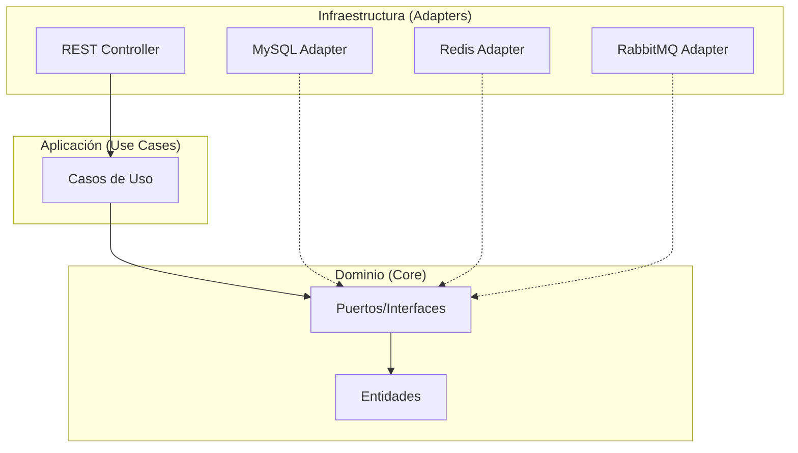
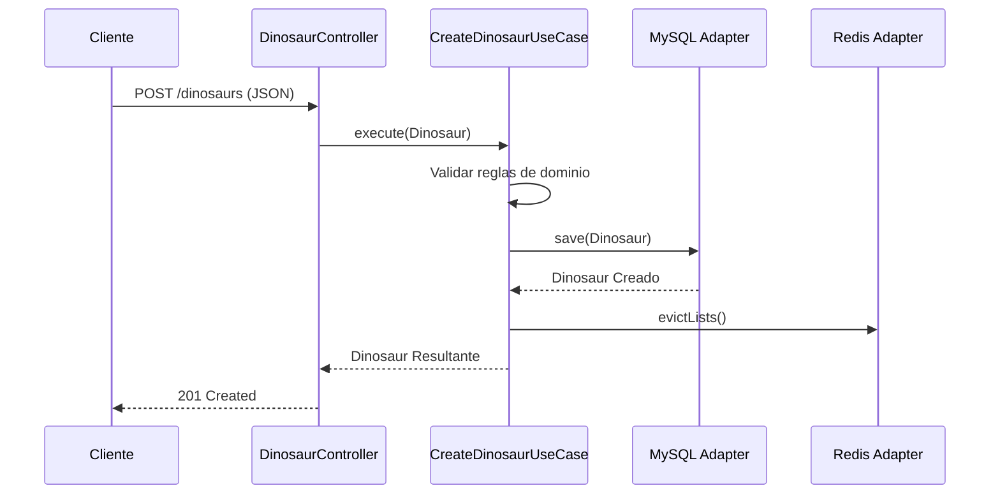
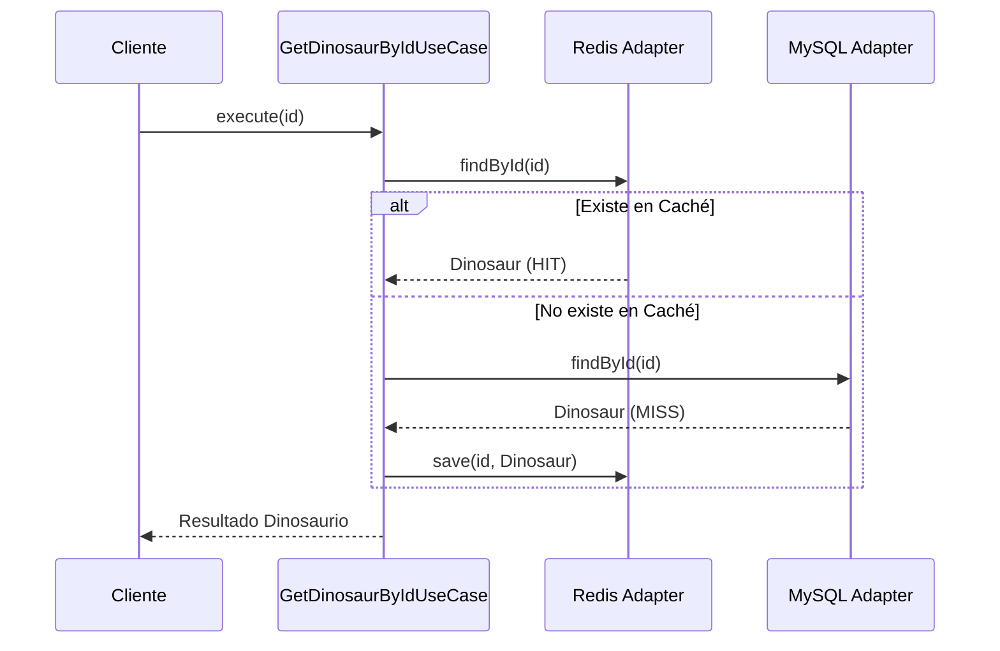

# Challenge Dino API 🦖

API REST para la gestión de dinosaurios, diseñada bajo los principios de **Arquitectura Hexagonal (Ports & Adapters)** y **Clean Architecture**. El sistema incluye persistencia en base de datos relacional, optimización mediante caché y comunicación asíncrona mediante mensajería.

## 🚀 Tecnologías y Dependencias

El proyecto utiliza el stack tecnológico de **Spring Boot 3.4** con las siguientes dependencias clave:

| Dependencia | Justificación |
| :--- | :--- |
| **Java 21 (LTS)** | Uso de las últimas características del lenguaje (Virtual Threads, Records) y mejor rendimiento. |
| **Spring Data JPA** | Abstracción de la capa de persistencia para interactuar de forma eficiente con MySQL. |
| **MySQL Driver** | Motor de base de datos relacional para garantizar la integridad y consistencia de los datos. |
| **Spring Data Redis** | Implementación del patrón *Cache-Aside* para mejorar el rendimiento en lecturas frecuentes. |
| **Spring AMQP (RabbitMQ)** | Manejo de comunicación asíncrona y basada en eventos para actualizaciones de estado. |
| **Lombok** | Reducción de código repetitivo (*boilerplate*) mediante anotaciones para constructores, getters y setters. |
| **Docker & Docker Compose** | Contenerización de la aplicación y sus servicios para garantizar uniformidad en cualquier ambiente. |

---

## 🏗️ Arquitectura Hexagonal

La aplicación sigue una arquitectura desacoplada donde el **Dominio** es el centro, rodeado por la capa de **Aplicación** y finalmente la **Infraestructura**.

### Capas del Proyecto:
1.  **Dominio (Core)**: Contiene las entidades de negocio (`Dinosaur`) y las interfaces (`Ports`) que definen el contrato. No tiene dependencias de frameworks externos.
2.  **Aplicación (Use Cases)**: Implementa la lógica de negocio coordinando los puertos de entrada y salida.
3.  **Infraestructura (Adapters)**: Implementaciones técnicas de los puertos (Controladores REST, Repositorios JPA, Clientes Redis, Consumidores RabbitMQ).

### Diagrama de Arquitectura


---

## 🛠️ Instalación y Configuración

### Prerrequisitos
- **Java 21** instalado.
- **Maven 3.x** para la gestión de dependencias.
- **Docker & Docker Desktop** (incluyendo Docker Compose).

### Paso a paso
1.  **Clonar el repositorio**:
    ```bash
    git clone https://github.com/roxanaelisacano/challenge-dino-api.git
    cd challenge-dino-api
    ```

2.  **Configurar variables de entorno**:
    El proyecto ya viene preconfigurado para funcionar con los valores por defecto de `compose.yaml`. Si deseas cambiar credenciales, revisa el archivo `application.properties`.

3.  **Construir el proyecto**:
    ```bash
    mvn clean install -DskipTests
    ```

---

## 🐳 Docker y Docker Compose

La aplicación está diseñada para ejecutarse fácilmente mediante contenedores. El archivo `compose.yaml` levanta automáticamente:
- **Dino API** (Puerto 8080)
- **MySQL** (Puerto 3306)
- **Redis** (Puerto 6379)
- **RabbitMQ** (Puertos 5672, 15672 para administración)

### Ejecutar todo el stack:
```bash
docker-compose up --build
```
Una vez levantado, puedes acceder al panel de administración de RabbitMQ en `http://localhost:15672` (usuario: `guest`, clave: `guest`).

---

## 🔄 Funcionamiento de la Aplicación

### Casos de Uso Principales

#### 1. Creación de un Dinosaurio
Cuando se crea un dinosaurio, se valida su nombre único y fechas. El sistema persiste en la DB e invalida las listas de caché para asegurar consistencia.



#### 2. Obtención por ID
Se utiliza el patrón *Cache-Aside*: se busca primero en Redis y, si no existe, se consulta en MySQL y se guarda en caché para futuras peticiones.



---

## 👤 Autor
**Roxana Elisa Cano**  
📧 [roxanaelisacano@gmail.com](mailto:roxanaelisacano@gmail.com)  
🔗 [GitHub: @roxanaelisacano](https://github.com/roxanaelisacano)
